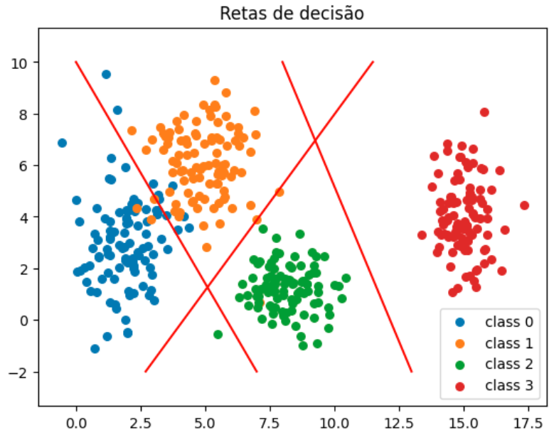
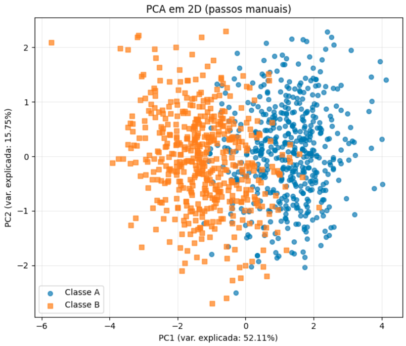

## Exercício 1 – Exploring Class Separability in 2D

### Geração dos Dados
```python
import matplotlib.pyplot as plt
import numpy as np

parameters = [
    ([2, 3], [0.8, 2.5]),
    ([5, 6], [1.2, 1.9]),
    ([8, 1], [0.9, 0.9]),
    ([15, 4], [0.5, 2.0])
]

i = 0
while i < len(parameters):
    p = parameters[i]
    mean = p[0]
    cov = np.diag(p[1])  
    x, y = np.random.multivariate_normal(mean, cov, 100).T
    plt.scatter(x, y, s=30, label=f'class {i}')
    i += 1

plt.title("Retas de decisão")
plt.plot([0, 7], [10, -2], color='red')
plt.plot([8, 13], [10, -2], color='red')
plt.plot([2.7, 11.5], [-2, 10], color='red')
plt.axis('equal')
plt.legend()
plt.show()
```

### Análise

As quatro classes são separadas, mas não por uma única linha reta. É necessário mais de uma reta de decisão (três linhas no exemplo), correspondendo ao que uma rede com múltiplos neurônios poderia aprender.



## Exercício 2 – Non-Linearity in Higher Dimensions

### Geração dos Dados

```python
import numpy as np
import pandas as pd
import matplotlib.pyplot as plt
from sklearn.decomposition import PCA

# Classe A
mu_A = [0, 0, 0, 0, 0]
sigma_A = np.array([
    [1.0, 0.8, 0.1, 0.0, 0.0],
    [0.8, 1.0, 0.3, 0.0, 0.0],
    [0.1, 0.3, 1.0, 0.5, 0.0],
    [0.0, 0.0, 0.5, 1.0, 0.2],
    [0.0, 0.0, 0.0, 0.2, 1.0]
])
class_A = np.random.multivariate_normal(mu_A, sigma_A, 500)

# Classe B
mu_B = [1.5, 1.5, 1.5, 1.5, 1.5]
sigma_B = np.array([
    [1.5, -0.7, 0.2, 0.0, 0.0],
    [-0.7, 1.5, 0.4, 0.0, 0.0],
    [0.2, 0.4, 1.5, 0.6, 0.0],
    [0.0, 0.0, 0.6, 1.5, 0.3],
    [0.0, 0.0, 0.0, 0.3, 1.5]
])
class_B = np.random.multivariate_normal(mu_B, sigma_B, 500)

# PCA para 2D
X = np.vstack((class_A, class_B))
y = np.array([0]*500 + [1]*500)

pca = PCA(n_components=2)
X_pca = pca.fit_transform(X)

plt.scatter(X_pca[y==0, 0], X_pca[y==0, 1], label="Class A", alpha=0.5)
plt.scatter(X_pca[y==1, 0], X_pca[y==1, 1], label="Class B", alpha=0.5)
plt.legend()
plt.title("Projeção PCA das Classes")
plt.show()
```



### Análise

As classes apresentam separação parcial no primeiro componente principal, mas com sobreposição significativa. Isso mostra que os dados não são linearmente separáveis.
Modelos lineares simples teriam dificuldade, sendo necessário usar redes neurais com funções de ativação não-lineares.


## Exercício 3 – Preparing Real-World Data for a Neural Network

### Carregamento e Descrição

O dataset **Spaceship Titanic** contém informações de passageiros para prever se foram transportados após a colisão da nave.

* **Target (`Transported`)**: indica se o passageiro foi transportado (`True/False`).
* **Variáveis Numéricas**: `Age`, `RoomService`, `FoodCourt`, `ShoppingMall`, `Spa`, `VRDeck`.
* **Variáveis Categóricas**: `HomePlanet`, `CryoSleep`, `Cabin`, `Destination`, `VIP`, `PassengerId`, `Name`.

### Pré-Processamento

```python
import pandas as pd
import matplotlib.pyplot as plt

df = pd.read_csv("data/train.csv")

df_clean = df.drop(columns=["PassengerId", "Name", "Cabin"])

# Tratar missing values
num_cols = ["Age", "RoomService", "FoodCourt", "ShoppingMall", "Spa", "VRDeck"]
for col in num_cols:
    df_clean[col] = df_clean[col].fillna(df_clean[col].median())

cat_cols = ["HomePlanet", "CryoSleep", "Destination", "VIP"]
for col in cat_cols:
    df_clean[col] = df_clean[col].fillna(df_clean[col].mode()[0])

# One-hot encoding
df_encoded = pd.get_dummies(df_clean, columns=cat_cols, drop_first=False)

# Converter target para {-1, 1}
df_encoded["Transported"] = df_encoded["Transported"].map({True: 1, False: -1})

# Padronizar numéricos
for col in num_cols:
    mean = df_encoded[col].mean()
    std = df_encoded[col].std()
    df_encoded[col] = (df_encoded[col] - mean) / std
```

### Visualização

```python
fig, axes = plt.subplots(2, 2, figsize=(12, 8))

axes[0,0].hist(df["Age"].dropna(), bins=30, color='skyblue', edgecolor='black')
axes[0,0].set_title("Age antes do Scaling")
axes[0,1].hist(df["FoodCourt"].dropna(), bins=30, color='salmon', edgecolor='black')
axes[0,1].set_title("FoodCourt antes do Scaling")

axes[1,0].hist(df_encoded["Age"], bins=30, color='skyblue', edgecolor='black')
axes[1,0].set_title("Age depois da normalização")
axes[1,1].hist(df_encoded["FoodCourt"], bins=30, color='salmon', edgecolor='black')
axes[1,1].set_title("FoodCourt depois da normalização")

plt.tight_layout()
plt.show()
```


### Análise

* Os valores numéricos foram padronizados para média 0 e desvio padrão 1, ideal para funções de ativação `tanh`.
* Valores categóricos foram tratados com **one-hot encoding**.
* Valores ausentes foram preenchidos de forma consistente.
* As distribuições antes e depois do processamento mostram claramente a normalização aplicada.


