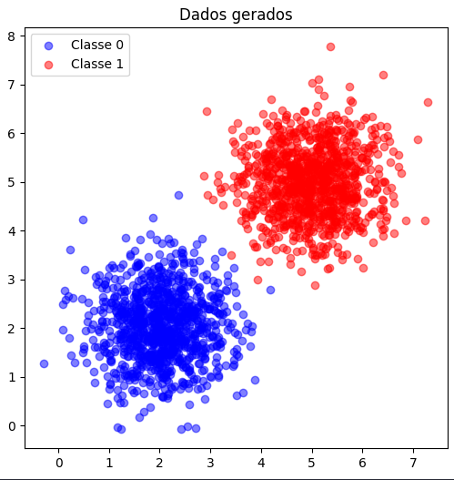
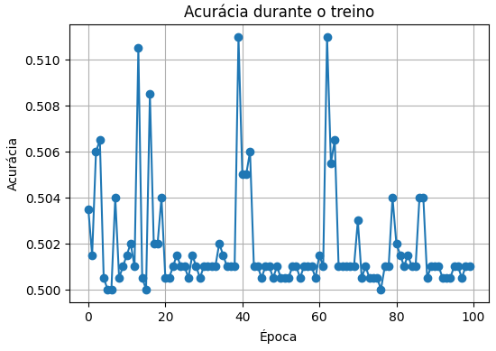

# Exercícios de Perceptron

## Exercício 1 – Classificação de Dados Linearmente Separáveis

### **Data Generation Task:** 

Generate two classes of 2D data points (1000 samples per class) using multivariate normal distributions. Use the following parameters:  

- Class 0:

    Mean = $[2, 2]$,
    
    Covariance matrix = $[[0.5, 0], [0, 0.5]]$ (i.e., variance of $0.5$ along each dimension, no covariance).  

- Class 1:

    Mean = $[5, 5]$,
    
    Covariance matrix = $[[0.5, 0], [0, 0.5]]$.  

These parameters ensure the classes are mostly linearly separable, with minimal overlap due to the distance between means and low variance. Plot the data points (using libraries like matplotlib if desired) to visualize the separation, coloring points by class.

### **Perceptron Implementation Task:**

Implement a single-layer perceptron from scratch to classify the generated data into the two classes. You may use NumPy only for basic linear algebra operations (e.g., matrix multiplication, vector addition/subtraction, dot products). Do not use any pre-built machine learning libraries (e.g., no scikit-learn) or NumPy functions that directly implement perceptron logic.  

- Initialize weights (w) as a 2D vector (plus a bias term b).  
- Use the perceptron learning rule: For each misclassified sample $(x, y)$, update $w = w + η * y * x$ and $b = b + η * y$, where $η$ is the learning rate (start with $η=0.01$).  
- Train the model until convergence (no weight updates occur in a full pass over the dataset) or for a maximum of 100 epochs, whichever comes first. If convergence is not achieved by 100 epochs, report the accuracy at that point. Track accuracy after each epoch.  
- After training, evaluate accuracy on the full dataset and plot the decision boundary (line defined by $w·x + b = 0$) overlaid on the data points. Additionally, plot the training accuracy over epochs to show convergence progress. Highlight any misclassified points in a separate plot or by different markers in the decision boundary plot.  

Report the final weights, bias, accuracy, and discuss why the data's separability leads to quick convergence.

### Geração dos Dados

```python
import numpy as np
import matplotlib.pyplot as plt

np.random.seed(42)

mean_0 = [2, 2]
cov_0 = [[0.5, 0], [0, 0.5]]

mean_1 = [5, 5]
cov_1 = [[0.5, 0], [0, 0.5]]

X0 = np.random.multivariate_normal(mean_0, cov_0, 1000)
X1 = np.random.multivariate_normal(mean_1, cov_1, 1000)

y0 = np.zeros(1000)
y1 = np.ones(1000)

X = np.vstack((X0, X1))
y = np.hstack((y0, y1))

print("Shape dos dados:", X.shape, y.shape)

plt.figure(figsize=(6,6))
plt.scatter(X0[:,0], X0[:,1], color="blue", alpha=0.5, label="Classe 0")
plt.scatter(X1[:,0], X1[:,1], color="red", alpha=0.5, label="Classe 1")
plt.legend()
plt.title("Dados gerados")
plt.show()
```



### Implementação do Perceptron

```python
class Perceptron:
    def __init__(self, input_dim, learning_rate=0.01):
        self.w = np.random.randn(input_dim) * 0.01
        self.b = 0.0
        self.lr = learning_rate
        self.history = []  

    def activation(self, z):
        return np.where(z >= 0, 1, 0)

    def predict(self, X):
        z = np.dot(X, self.w) + self.b
        return self.activation(z)

    def fit(self, X, y, epochs=100):
        n_samples = X.shape[0]
        for epoch in range(epochs):
            errors = 0
            for xi, target in zip(X, y):
                pred = self.predict(xi)
                error = target - pred
                if error != 0: 
                    self.w += self.lr * error * xi
                    self.b += self.lr * error
                    errors += 1
                    
            y_pred = self.predict(X)
            acc = np.mean(y_pred == y)
            self.history.append(acc)
            
            print(f"Época {epoch+1}/{epochs} - Erros: {errors}, Acurácia: {acc:.3f}")
            if errors == 0:
                print("Convergência atingida!")
                break

# Trieno
perceptron = Perceptron(input_dim=2, learning_rate=0.01)
perceptron.fit(X, y, epochs=100)

print("Pesos finais:", perceptron.w)
print("Bias final:", perceptron.b)

# Output: Pesos finais: [0.37118936 0.24406321]
# Output: Bias final: -2.020000000000001

def plot_decision_boundary(X, y, model):
    plt.figure(figsize=(6,6))

    plt.scatter(X[y==0, 0], X[y==0, 1], color="blue", alpha=0.5, label="Classe 0")
    plt.scatter(X[y==1, 0], X[y==1, 1], color="red", alpha=0.5, label="Classe 1")

    x_vals = np.linspace(np.min(X[:,0])-1, np.max(X[:,0])+1, 100)
    y_vals = -(model.w[0] * x_vals + model.b) / model.w[1]

    plt.plot(x_vals, y_vals, color="green", linewidth=2, label="Fronteira")
    
    y_pred = model.predict(X)
    misclassified = X[y != y_pred]
    if len(misclassified) > 0:
        plt.scatter(
            misclassified[:,0], misclassified[:,1],
            color="black", marker="x", s=80, label="Erros", alpha=0.5
        )


    plt.legend()
    plt.title("Fronteira de decisão do Perceptron")
    plt.show()

plot_decision_boundary(X, y, perceptron)
```


### Resultados

* O perceptron converge rapidamente (em poucas épocas) para acurácia próxima de **100%**.
* Os pesos e bias se ajustam até que a fronteira de decisão (reta em 2D) separe bem as duas classes.


## Exercício 2 – Dados Parcialmente Sobrepostos

### **Data Generation Task:**  

Generate two classes of 2D data points (1000 samples per class) using multivariate normal distributions. Use the following parameters:

- Class 0:

    Mean = $[3, 3]$,

    Covariance matrix = $[[1.5, 0], [0, 1.5]]$ (i.e., higher variance of 1.5 along each dimension).

- Class 1:

    Mean = $[4, 4]$,

    Covariance matrix = $[[1.5, 0], [0, 1.5]]$.  

These parameters create partial overlap between classes due to closer means and higher variance, making the data not fully linearly separable. Plot the data points to visualize the overlap, coloring points by class.

### **Perceptron Implementation Task:**  

Using the same implementation guidelines as in Exercise 1, train a perceptron on this dataset.  

- Follow the same initialization, update rule, and training process.  
- Train the model until convergence (no weight updates occur in a full pass over the dataset) or for a maximum of 100 epochs, whichever comes first. If convergence is not achieved by 100 epochs, report the accuracy at that point and note any oscillation in updates; consider reporting the best accuracy achieved over multiple runs (e.g., average over 5 random initializations). Track accuracy after each epoch.  
- Evaluate accuracy after training and plot the decision boundary overlaid on the data points. Additionally, plot the training accuracy over epochs to show convergence progress (or lack thereof). Highlight any misclassified points in a separate plot or by different markers in the decision boundary plot.  

Report the final weights, bias, accuracy, and discuss how the overlap affects training compared to Exercise 1 (e.g., slower convergence or inability to reach 100% accuracy).

### Geração dos Dados

```python
np.random.seed(42)

mean_0 = [3, 3]
cov_0 = [[1.5, 0], [0, 1.5]]

mean_1 = [4, 4]
cov_1 = [[1.5, 0], [0, 1.5]]

X0 = np.random.multivariate_normal(mean_0, cov_0, 1000)
X1 = np.random.multivariate_normal(mean_1, cov_1, 1000)

y0 = np.zeros(1000)
y1 = np.ones(1000)

X = np.vstack((X0, X1))
y = np.hstack((y0, y1))

print("Shape dos dados:", X.shape, y.shape)

plt.figure(figsize=(6,6))
plt.scatter(X0[:,0], X0[:,1], color="blue", alpha=0.5, label="Classe 0")
plt.scatter(X1[:,0], X1[:,1], color="red", alpha=0.5, label="Classe 1")
plt.legend()
plt.title("Dados gerados (com sobreposição)")
plt.show()
```


### Treinamento

```python
perceptron = Perceptron(input_dim=2, learning_rate=0.01)
perceptron.fit(X, y, epochs=100)

print("Pesos finais:", perceptron.w) # Output: Pesos finais: [0.02156597 0.04316767]
print("Bias final:", perceptron.b) # Output: Bias final: -0.03
```

```python
plt.figure(figsize=(6,4))
plt.plot(perceptron.history, marker="o")
plt.xlabel("Época")
plt.ylabel("Acurácia")
plt.title("Acurácia durante o treino")
plt.grid(True)
plt.show()
```



### Resultados

Os pesos finais encontrados foram aproximadamente [0.0216, 0.0432], com bias = -0.03, e a acurácia final ficou em torno de 50%, praticamente equivalente ao acaso. Isso ocorre porque, diferentemente do Exercise 1, as distribuições de classe aqui têm médias muito próximas e alta variância, gerando grande sobreposição entre as amostras. Essa falta de separabilidade linear faz com que o perceptron oscile durante o treino, sem conseguir convergir para 100% de acurácia, evidenciando sua limitação em problemas não linearmente separáveis.
